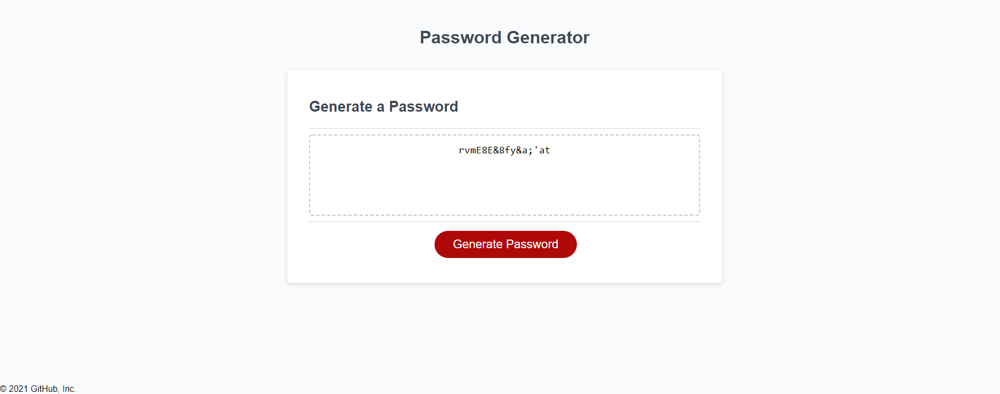

# challenge-3-random-pw-generator

## Challenge Requirements
* Create a generate password function that runs when the button is clicked.
* Ask the user how many characters they would like (8 - 128). 
* Ask the user if they would like to include lowercase, capitals, numbers and/or special characters.
* After they answer their questions, display the generated password based on their criteria on the webpage.

## Final Website Screenshot

## Link to Portfolio Website
[PW Generator Deployed Website](https://mjgiannelli.github.io/challenge-3-random-pw-generator/)